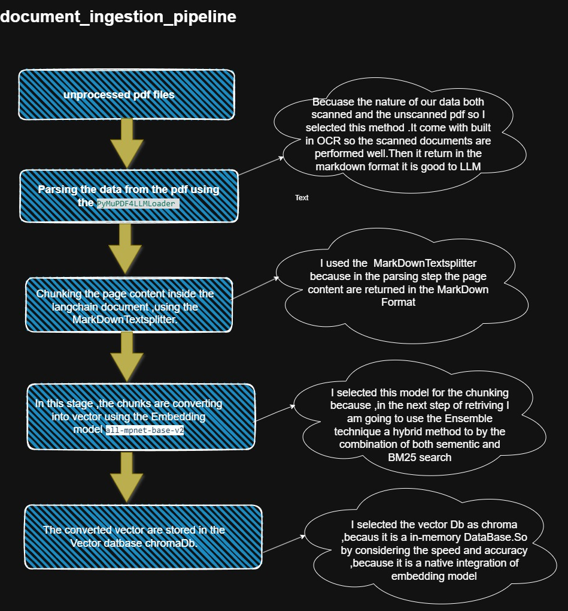
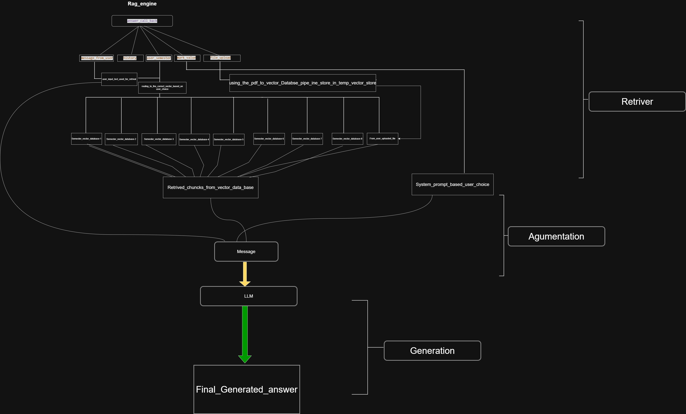

### AI-Powered Retrieval-Augmented Generation (RAG) System for University Examination Preparation

University Answer Bot is an intelligent educational assistant designed to help engineering students generate accurate, syllabus-oriented, and examination-ready answers from university-prescribed textbooks and study materials. The application combines **Hybrid Retrieval (BM25 + Semantic Search)**, **Retrieval-Augmented Generation (RAG)**, **Prompt Engineering**, and **Large Language Models** to provide reliable, grounded, and structured academic answers.

---

# 📌 Problem Statement

Engineering students typically depend on multiple learning resources such as lecture notes, prescribed textbooks, PDFs, laboratory manuals, and previous semester question papers to prepare for examinations. Since the required information is distributed across multiple resources, students spend a significant amount of time searching through different books and documents to understand a single concept or answer a specific question.

With the rapid advancement of Artificial Intelligence, many students now use Large Language Models (LLMs) such as ChatGPT and similar AI systems to study concepts and generate answers. Although these models produce detailed responses, they often use different terminology, writing styles, and explanations compared to university-prescribed textbooks.

For example, an LLM may explain the same concept using the terms **"Loss Function"** and **"Cost Function."** While both terms are technically related, students who are learning the concept for the first time—especially during last-minute examination preparation—can become confused by these inconsistent terminologies.

Similarly, AI-generated answers may be conceptually correct but may not follow the terminology, structure, and presentation style expected by university evaluation standards. During my own examination preparation, I observed that even though my answers were technically correct, they differed from my mentor's answer key because the terminology and presentation were not aligned with the university's prescribed academic standards.

After researching this issue, I found that general-purpose Large Language Models are trained primarily on large-scale internet data. Consequently, they generate answers based on statistically probable words rather than strictly following university-prescribed textbooks and examination patterns. As a result, students may receive academically correct answers that are not always suitable for university examinations.

These challenges motivated the development of an intelligent educational assistant capable of generating **grounded, syllabus-oriented, and examination-ready answers** using university-prescribed learning materials.

---

# 💡 Proposed Solution

To address these challenges, I developed **University Answer Bot**, an AI-powered educational assistant built using the **Retrieval-Augmented Generation (RAG)** architecture.

Instead of relying solely on the internal knowledge of a Large Language Model, the application first retrieves relevant information from university-prescribed textbooks before generating an answer. This approach ensures that every response is grounded in authentic academic resources while maintaining consistency with university terminology and examination standards.

The first version of the system was developed using the prescribed textbooks for the **B.Tech Artificial Intelligence and Data Science (Regulation 2021)** curriculum. These documents were processed through a document ingestion pipeline, converted into vector embeddings, and stored in a Chroma Vector Database.

When a student submits a question, the application performs **Hybrid Retrieval** by combining:

- BM25 Keyword Search
- Semantic Vector Search

The retrieved document chunks are then provided as context to **GPT-OSS-120B** through the Groq API. By supplying relevant academic context before answer generation, the model produces grounded and examination-oriented responses while significantly reducing hallucinations.

To further improve answer quality, the system incorporates **Bloom's Taxonomy-based Prompt Engineering**. Depending on the selected examination pattern (2 Marks, 5 Marks, 10 Marks, 16 Marks, 18 Marks, 20 Marks, or Learn Mode), the application dynamically selects an appropriate system prompt that guides the language model to generate answers with proper introductions, structured explanations, important keywords, diagrams (where applicable), and conclusions.

The latest version also introduces a **Custom PDF Upload** feature. Students from **any department or academic discipline** can upload their own study materials, lecture notes, or textbooks. The uploaded documents are automatically processed through the same document ingestion pipeline, converted into vector embeddings, and stored in a temporary vector database. Students can then ask questions directly from their own study materials without requiring any model retraining or fine-tuning.

This feature transforms the application from a department-specific educational assistant into a **general-purpose AI learning platform** capable of supporting students from different universities and disciplines while ensuring that every generated answer remains grounded in the uploaded academic material.

---

# ⚙️ Working

The application follows a complete Retrieval-Augmented Generation (RAG) workflow.

### Step 1 – User Input

The student enters a question through the Gradio interface and selects:

- Semester
- Answer Type (2, 5, 10, 16, 18, 20 Marks or Learn Mode)

Optionally, the student can upload a custom PDF.

---

### Step 2 – Knowledge Base Selection

Based on the selected semester or uploaded PDF, the application chooses the appropriate Chroma Vector Database.

---

### Step 3 – Hybrid Retrieval

The system performs:

- BM25 Keyword Search
- Semantic Vector Search

Both retrieval methods are combined using LangChain's Ensemble Retriever to retrieve the most relevant document chunks.

---

### Step 4 – Prompt Augmentation

The retrieved document chunks are injected into the selected system prompt together with the user's question.

---

### Step 5 – Answer Generation

GPT-OSS-120B receives:

- System Prompt
- Retrieved Context
- User Question

and generates a grounded, examination-oriented answer.

---

### Step 6 – Response

The generated answer is displayed in the Gradio interface.

---
### documnet_ingestion_pipeline_architecture

  

---
### rag_engine architecture

  

# 👨‍💻 Author

**Thirumaran V**

**B.Tech Artificial Intelligence and Data Science**

---

⭐ If you found this project interesting, consider giving it a star on GitHub.